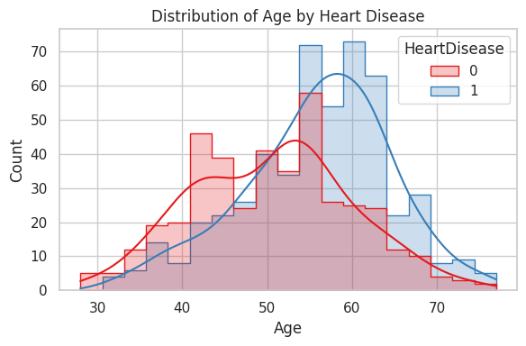
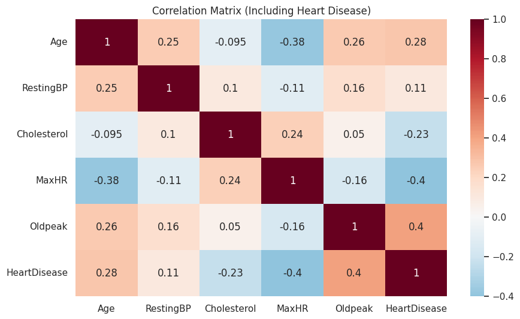

# Heart Failure Prediction - Exploratory Data Analysis

## Overview

This project performs a comprehensive exploratory data analysis (EDA) on the Heart Failure Prediction dataset from Kaggle to understand factors that contribute to heart disease and identify patterns in the data.

## Dataset

The analysis uses the Heart Failure Prediction Dataset from Kaggle which includes the following features:

- **Age**: Age of the patient in years
- **Sex**: Gender of the patient (M: Male, F: Female)
- **ChestPainType**: Type of chest pain (TA: Typical Angina, ATA: Atypical Angina, NAP: Non-Anginal Pain, ASY: Asymptomatic)
- **RestingBP**: Resting blood pressure in mm Hg
- **Cholesterol**: Serum cholesterol in mg/dl
- **FastingBS**: Fasting blood sugar > 120 mg/dl (1: true, 0: false)
- **RestingECG**: Resting electrocardiogram results (Normal, ST: having ST-T wave abnormality, LVH: showing left ventricular hypertrophy)
- **MaxHR**: Maximum heart rate achieved
- **ExerciseAngina**: Exercise-induced angina (Y: Yes, N: No)
- **Oldpeak**: ST depression induced by exercise relative to rest
- **ST_Slope**: Slope of the peak exercise ST segment (Up, Flat, Down)
- **HeartDisease**: Output class (1: heart disease, 0: normal)

## Visualizations

### Age Distribution by Heart Disease

The histogram shows that patients with heart disease (blue) tend to be older on average compared to those without heart disease (red).

### Correlation Matrix

The correlation matrix reveals important relationships:
- Heart disease shows positive correlation with Age (0.28) and Oldpeak (0.4)
- Heart disease shows negative correlation with MaxHR (-0.4) and Cholesterol (-0.23)
- Age is negatively correlated with MaxHR (-0.38)

## Analysis Performed

### 1. Data Quality Assessment

- Checking for missing values
- Examining statistical summaries
- Identifying anomalies (e.g., zero values in cholesterol)

### 2. Univariate Analysis

- Distribution of numeric features (Age, RestingBP, Cholesterol, MaxHR, Oldpeak)
- Boxplots to identify outliers
- Value counts for categorical features

### 3. Multivariate Analysis

- Pairplots to visualize relationships between numeric features
- Analysis by heart disease status

### 4. Correlation Analysis

- Heatmap of correlations between numeric features
- Identification of strong relationships with heart disease

### 5. Feature-Specific Analysis

- **Age Analysis**: How age relates to heart disease risk
- **Chest Pain Type Analysis**: Different types of chest pain and their relationship with heart disease
- **Blood Pressure and Cholesterol Analysis**: Blood pressure and cholesterol levels across patients
- **Maximum Heart Rate Analysis**: Relationship between MaxHR and heart disease
- **Oldpeak Analysis**: How ST depression correlates with heart disease
- **Exercise Angina Analysis**: Impact of exercise-induced angina
- **ST Slope Analysis**: How the slope of the peak exercise ST segment relates to heart disease

### 6. Categorical Features Analysis

- Distribution of categorical variables and their relationship with heart disease

## Key Findings

1. Strong correlations exist between certain features and heart disease:

   - Positive correlation with Oldpeak (ST depression)
   - Negative correlation with MaxHR (maximum heart rate)
2. Categorical features like chest pain type, exercise-induced angina, and ST slope are strong indicators of heart disease risk
3. Age is an important factor, with older patients generally having a higher risk
4. The dataset contains some anomalies, such as zero cholesterol values, that would need preprocessing

## Tools and Libraries Used

- **pandas** for data manipulation
- **numpy** for numerical operations
- **seaborn** and **matplotlib** for data visualization
- **kagglehub** for downloading the dataset

## Conclusion

This exploratory data analysis reveals several key insights about the heart failure prediction dataset:

* **Strong correlations**: Oldpeak shows a positive correlation with heart disease, while MaxHR shows a negative correlation.
* **Categorical features**: Chest pain type, exercise-induced angina, and ST slope are strong indicators of heart disease risk.

* **Age factor**: Older patients generally have a higher risk of heart disease.
* **Cholesterol anomaly**: There are unusual zero values for cholesterol that may need to be addressed in preprocessing.

These insights can guide further preprocessing and feature selection for developing a heart disease prediction model.
